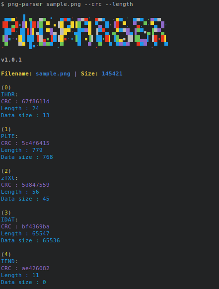

# png-parser

Best tool to analyse PNG file, it show you png chunks : header, palette and text.





```sh
pip install --user git+https://github.com/Hedroed/png-parser
```


## Usage

To use it:

```sh
> $ png-parser --help

 ▄▄▄· ▐ ▄  ▄▄ •  ▄▄▄· ▄▄▄· ▄▄▄  .▄▄ · ▄▄▄ .▄▄▄
▐█ ▄█•█▌▐█▐█ ▀ ▪▐█ ▄█▐█ ▀█ ▀▄ █·▐█ ▀. ▀▄.▀·▀▄ █·
 ██▀·▐█▐▐▌▄█ ▀█▄ ██▀·▄█▀▀█ ▐▀▀▄ ▄▀▀▀█▄▐▀▀▪▄▐▀▀▄
▐█▪·•██▐█▌▐█▄▪▐█▐█▪·•▐█ ▪▐▌▐█•█▌▐█▄▪▐█▐█▄▄▌▐█•█▌
.▀   ▀▀ █▪·▀▀▀▀ .▀    ▀  ▀ .▀  ▀ ▀▀▀▀  ▀▀▀ .▀  ▀
 v1.1.0

usage: png-parser [-h] [-a | -c CHUNK_ID | -t TYPE | --text] [-d] [--length] [--crc] [--hex] [--show] [--output OUTPUT] [-v] file

Prints PNG text sections

positional arguments:
  file                  an PNG image

optional arguments:
  -h, --help            show this help message and exit
  -a, --all             Print all chunk infos
  --text                Display all text chunk
  -c CHUNK_ID, --chunk CHUNK_ID
                        Print the chunk with this id
  -t TYPE, --type TYPE  Filter chunk by type
  -d, --data            Print chunk data
  --length          Print chunk length
  --crc             Print chunk crc and check if is right
  --hex                 Print bytes position in Hexadecimal
  -s, --show            Show image
  --output OUTPUT       Save image (fix input file errors if any)
  -v, --verbose         Verbose mode```


## API


### Class PngParser

PngParser(file)

file: str or file type

PngParser.get_image_data()

PngParser.set_image_data()

PngParser.get_chunk_by_index(idx)

PngParser.get_chunk_by_type(type)


### Class Chunk

Chunk(type, data=None, crc=None)

Chunk.update_crc()

Chunk.length


### Class ImageData

ImageData(header, data, palette=None)

ImageData.scanlines

ImageData.get_pixel(x, y)

ImageData.set_pixel(x, y, pixel)
ImageData.set_pixel(x, y, data)


### Class Scanline

Scanline(filter, data, previous=None)

Scanline.filter

Scanline.data


### Class Pixel

Pixel(type, channels)
Pixel.__getitem__


## Dev


### Install for development

```sh
python setup.py develop
```

### Run example

```
python example/read_png_filters.py
```


# DOC

## PNG Chunks

| Length  | Chunk type |  Chunk data  |   CRC   |
|---------|------------|--------------|---------|
| 4 bytes | 4 bytes    | Length bytes | 4 bytes |

## Critical chunks:

- **IHDR** : must be the first chunk; it contains (in this order) the image's width,
        height, bit depth, color type, compression method, filter method, and
        interlace method (13 data bytes total).

- **PLTE** : contains the palette; list of colors.

- **IDAT** : contains the image, which may be split among multiple IDAT chunks.
        Such splitting increases filesize slightly, but makes it possible to
        generate a PNG in a streaming manner. The IDAT chunk contains the
        actual image data, which is the output stream of the compression
        algorithm.

- **IEND** : marks the image end.

## Ancillary chunks:

- **bKGD** : gives the default background color. It is intended for use when there
        is no better choice available, such as in standalone image viewers (but
        not web browsers; see below for more details).

- **cHRM** : gives the chromaticity coordinates of the display primaries and white
        point.

- **dSIG** : is for storing digital signatures.

- **eXIf** : stores Exif data.

- **gAMA** : specifies gamma.

- **hIST** : can store the histogram, or total amount of each color in the image.

- **iCCP** : is an ICC color profile.

- **iTXt** : contains a keyword and UTF-8 text, with encodings for possible
        compression and translations marked with language tag. The Extensible
        Metadata Platform (XMP) uses this chunk with a keyword
        'XML:com.adobe.xmp'

- **pHYs** : holds the intended pixel size and/or aspect ratio of the image.

- **sBIT** : (significant bits) indicates the color-accuracy of the source data.

- **sPLT** : suggests a palette to use if the full range of colors is unavailable.

- **sRGB** : indicates that the standard sRGB color space is used.

- **sTER** : stereo-image indicator chunk for stereoscopic images.[15]

- **tEXt** : can store text that can be represented in ISO/IEC 8859-1, with one
        key-value pair for each chunk. The "key" must be between 1 and 79
        characters long. Separator is a null character. The "value" can be any
        length, including zero up to the maximum permissible chunk size minus
        the length of the keyword and separator. Neither "key" nor "value" can
        contain null character. Leading or trailing spaces are also disallowed.

- **tIME** : stores the time that the image was last changed.

- **tRNS** : contains transparency information. For indexed images, it stores alpha
        channel values for one or more palette entries. For truecolor and
        grayscale images, it stores a single pixel value that is to be regarded
        as fully transparent.

- **zTXt** : contains compressed text (and a compression method marker) with the
        same limits as tEXt.

(c) https://en.wikipedia.org/wiki/Portable_Network_Graphics#File_header
